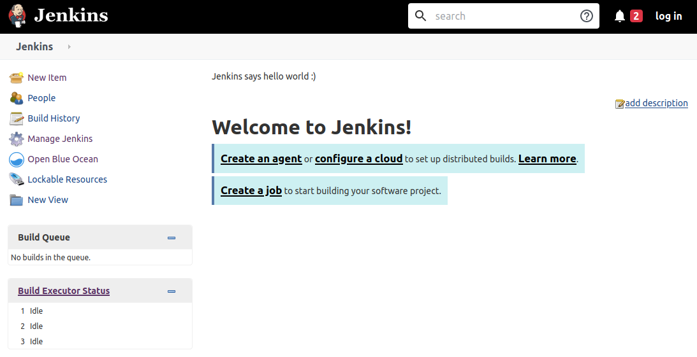

# Initial setup

> Note: if you do not have a Jenkins server
> provided by the trainer, head over and read
> [how to set Jenkins up](./setup-on-your-own.md)

In order for you to interact with Jenkins, you
need to have a fork of this git repository on your
own account. All your work will be made in the
fork, so you do not get disturbed by all the other
students.

## Tasks

- Fork the repository to your own github account.

Now you are able to push new changes to your
repository and have Jenkins build them

## Navigate to jenkins, is it working?

You should now be able to navigate to your Jenkins
instance! Go to `http://<your-hostname>:8080` and
you will be presented with a screen like the one
below. If you're trying this on you own computer
using docker, you'll use `localhost` as
`<your-hostname>` otherwise for the purpose of
this excercise, use the provided public
hostname/ip.

Click login, and use the username `admin` and your
password.

## Create a personal access token on github

In order for Jenkins to access your GitHub repositories, you need to create a personal access token:

1. Log in to your GitHub account
2. Click on your profile picture in the top-right corner and select "Settings"
3. Scroll down and click on "Developer settings" in the left sidebar
4. Click on "Personal access tokens" and then "Tokens (classic)"
5. Click on "Generate new token" and select "Generate new token (classic)"
6. Give your token a descriptive name like "Jenkins Access"
7. Select the following scopes:
   - `repo` (all)
   - `admin:repo_hook`
8. Click "Generate token"
9. **Important**: Copy the generated token immediately and save it somewhere secure. You will not be able to see it again!

This token will be used later when configuring Jenkins to connect to your GitHub repositories.

## add token as github credentials in jenkins

Now that you have created your GitHub personal access token, you need to add it to Jenkins:

1. In Jenkins, click on "Manage Jenkins" in the left navigation menu
2. Click on "Manage Credentials"
3. Click on "Jenkins" under the "Stores scoped to Jenkins" section
4. Click on "Global credentials (unrestricted)"
5. Click on "Add Credentials" in the left menu
6. Fill in the form:
   - Kind: Select "Username with password"
   - Scope: Keep as "Global"
   - Username: Enter your GitHub username
   - Password: Paste your GitHub personal access token you just created
   - ID: provide a meaningful ID like "github-token"
   - Description: "GitHub Personal Access Token" or something descriptive
7. Click "OK" to save the credentials

These credentials will now be available for use in Jenkins jobs that need to interact with your GitHub repositories. You'll reference these credentials when setting up pipelines or jobs that need to clone, push, or otherwise interact with your GitHub repositories.
